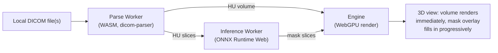

# OmniMed3D

A browser-only, on-device medical 3D DICOM viewer: WebGPU volume
rendering plus AI organ/structure segmentation, where the entire
pipeline — DICOM parsing, preprocessing, AI inference, and rendering —
runs client-side. No file is ever uploaded to a server, and once the
static assets are loaded once, the app keeps working offline.

**Status: early-stage prototype, under active development.** This is
research/prototype software — it is not a certified clinical device, and
does not aim for clinical-grade diagnostic accuracy.

## Why

Most web-based DICOM viewers either depend on a server for parsing/AI
inference, or fall back to WebGL and hit a performance ceiling on real
volumetric data. OmniMed3D's core bet: WebGPU is capable enough to do
cinematic-quality volume rendering _and_ run AI segmentation, entirely
on-device, so the whole experience — installation-free, zero server
cost, complete data privacy — becomes viable for places that can't
support a traditional workstation or IT setup: small clinics, research
and teaching settings, telemedicine sessions, and mobile/ambulance
deployments with unstable or no network.

## Architecture at a glance



Everything above runs in the browser. The only thing a server ever does
is host the static files (HTML/JS/WASM/models) — see
[`docs/prd/PRD.md`](docs/prd/PRD.md) for the full requirements and the
mask-data contract (REQ-C01) that lets the rendering and AI sides stay
decoupled.

## Current scope & limitations

- **AI segmentation is lung-only.** The shipped model is `lungmask`
  (R231, Apache-2.0) — a single-organ model (PRD REQ-A01). Multi-organ /
  multi-class segmentation is a tracked future goal, not available
  today.
- **iOS and desktop Safari: AI inference is not practically usable.** A
  WebKit-specific bug in ONNX Runtime Web's WebGPU backend causes
  unbounded memory growth and crashes on real devices (see
  `viewer/src/workers/inference-worker/docs/adr/0003-webkit-routing.md`),
  so those browsers are routed to a WASM+INT8-only fallback with no GPU
  acceleration — measured at ~2.3s/slice, versus this project's
  <500ms/slice target elsewhere. Volume rendering and viewing work
  normally on iOS/Safari; only AI segmentation is affected.
- **Fully-supported browser target: Google Chrome** (Desktop + Mobile,
  PRD REQ-R07). Other Chromium browsers and Android generally work the
  same way; Firefox and desktop Safari are not yet supported (see
  Roadmap below).

### Roadmap (not implemented yet)

Tracked in [`docs/prd/PRD.md`](docs/prd/PRD.md) as P1/P2 requirements or
deferred-but-revisitable scope (§7.2) — listed here for visibility, not
a committed schedule:

- Multi-class / multi-organ segmentation (REQ-A14), and a second model
  architecture (e.g. spleen) as an architecture-reuse proof point.
- Firefox and desktop Safari support (REQ-R11).
- Measurement tools (distance/angle/volume) and collaboration tools
  (snapshot export, annotations) — REQ-R09/R10.
- An optional backend adapter (Orthanc + FastAPI) for PACS
  integration/batch processing in enterprise environments — REQ-A07/A12.
  Explicitly optional; the core product stays Pure On-Device.
- Chunked streaming parsing for multi-gigabyte DICOM series.
- Automated hardware fallback across WebNN → WebGPU → WASM (REQ-C02) —
  WebGPU/WASM only today.

## Monorepo layout

| Path                                          | What it is                                                                                                                                                                                                                                                  | Owner                                               |
| --------------------------------------------- | ----------------------------------------------------------------------------------------------------------------------------------------------------------------------------------------------------------------------------------------------------------- | --------------------------------------------------- |
| [`engine/`](engine/README.md)                 | The rendering core: a from-scratch C++20 engine with a Vulkan (native) + WebGPU/WASM (browser) RHI abstraction. Volume rendering, clinical window/level, the mask-overlay compositor. See [`engine/docs/RENDERING_SPEC.md`](engine/docs/RENDERING_SPEC.md). | `@nowead`                                           |
| [`viewer/`](viewer/README.md)                 | The web application shell wrapping the engine's WASM module, plus the Parse Worker (DICOM → Hounsfield Units) and [Inference Worker](viewer/src/workers/inference-worker/README.md) (ONNX Runtime Web segmentation) it hosts. An npm workspace — see its own README for the full build/test setup. | `@nowead` (Inference Worker subtree: `@hyuniverse`) |
| [`dicom-parser/`](dicom-parser/README.md)     | A shared C++20 DICOM parsing library, compiled to both a native target (engine dev/test tooling) and WASM (the Parse Worker) — one parser, not two independent implementations.                                                                             | `@nowead`                                           |
| [`ai-pipeline/`](ai-pipeline/README.md)       | Offline model work: [ONNX conversion](ai-pipeline/conversion/README.md), [PTQ quantization](ai-pipeline/quantization/README.md), Dice/IoU accuracy verification. Produces the static `.onnx` files the Inference Worker loads — no runtime server involved. | `@hyuniverse`                                       |
| [`test-data/`](test-data/lidc_idri/README.md) | Shared, real (de-identified) DICOM sample data, tracked via Git LFS.                                                                                                                                                                                        | `@nowead`                                           |
| `infra/`                                      |                                                                                                                                                                                                                                                             | `@hyuniverse`                                       |

See [`.github/CODEOWNERS`](.github/CODEOWNERS) for the exact review-routing rules.

## Getting started

Each module owns its own build; see its README for full detail. Quick pointers:

**Fastest path for local iteration** (after the one-time prerequisite
setup below — vcpkg, Emscripten, `npm install`): a single command
rebuilds the engine's WASM target, syncs it into the viewer, and starts
the dev server, instead of running each step by hand.

```sh
cd viewer
npm run sync-demo-ct   # one-time, or whenever the demo DICOM data changes
npm run dev:full       # Windows
npm run dev:full:mac   # macOS/Linux
```

`dev:full`/`dev:full:mac` (`viewer/scripts/dev-full.ps1`/`.sh`) chains
`engine/scripts/wasm-build.ps1`/`.sh` (the two-step Emscripten
configure+build below, collapsed into one call) →
`npm run sync-engine-wasm` → the same backgrounded dev server
`dev:start`/`dev:start:mac` uses — see
[`viewer/README.md`](viewer/README.md#building-and-testing) for
`dev:status`/`dev:stop` and what each step does individually. It does
**not** run `sync-demo-ct` — that only needs re-running when the demo
DICOM data itself changes, not on every engine rebuild.

**Engine** (C++20, needs [vcpkg](https://vcpkg.io) and, for the browser build, [Emscripten](https://emscripten.org)):

```sh
cd engine
cmake --preset macos-default   # or windows-default
cmake --build build

# Browser (WebGPU/WASM) build:
./scripts/emsdk-shell.sh "cmake --preset wasm-macos" ~/emsdk    # or emsdk-shell.ps1 / wasm-windows on Windows
./scripts/emsdk-shell.sh "cmake --build build_wasm" ~/emsdk
```

**Viewer** (Vite + TypeScript, npm workspaces):

```sh
cd viewer
npm install
npm run dev      # dev server
npm run build    # production build
npm test         # unit tests (vitest, across all workspace packages)
```

The viewer's dev server expects the engine's WASM build to already exist
— see [`viewer/README.md`](viewer/README.md#building-and-testing) for
the `sync-engine-wasm`/`sync-demo-ct` steps that wire the two together.

**dicom-parser** — not configured standalone; it's pulled into the
engine's own build via `add_subdirectory()`. Building `engine/` above
also builds and tests it — see
[`dicom-parser/README.md`](dicom-parser/README.md#build--test) for the
native-only targets that come out of that build (`dicom_inspect`, its
test suite) and the `ctest` command to run them.

## Documentation

- [`docs/prd/PRD.md`](docs/prd/PRD.md) — product requirements, the source of truth for what this project needs to satisfy.
- [`engine/docs/RENDERING_SPEC.md`](engine/docs/RENDERING_SPEC.md) — a living spec of exactly what the engine renders and what's currently tunable.
- [`docs/adr/`](docs/adr/) and [`engine/docs/adr/`](engine/docs/adr/) — architectural decision records, cross-team and engine-internal respectively.
- [`docs/verification/`](docs/verification/) — empirical verification reports (accuracy, latency, integration).

## Contributing

See [`CONTRIBUTING.md`](CONTRIBUTING.md) for branch naming, commit
message conventions, coding standards, and the PR process — and
[`CODE_OF_CONDUCT.md`](CODE_OF_CONDUCT.md) for community expectations.

## License

Apache License 2.0 — see [`LICENSE`](LICENSE). Third-party software,
model, and dataset attributions are tracked in [`NOTICE.md`](NOTICE.md).
