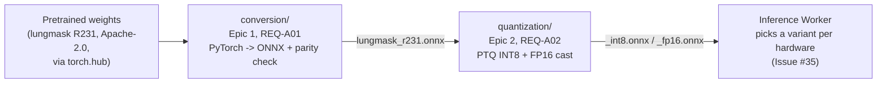

# ai-pipeline

Offline, dev-machine-only Python tooling (REQ-A01/A02) that turns the
pretrained lungmask R231 model into the browser-ready `.onnx` files
[`viewer/src/workers/inference-worker/`](../viewer/src/workers/inference-worker/README.md)
loads at runtime. Nothing in this directory ships to the browser or runs
on any server the app depends on — it produces static model artifacts
once, offline, and only those artifacts cross into the client-side
pipeline (NFR-01/05/06).

## Why two stages



| Directory | What it does | Owner |
| --- | --- | --- |
| [`conversion/`](conversion/README.md) | Epic 1 (REQ-A01): exports the pretrained model to ONNX and checks PyTorch/ONNX Runtime parity. One-time, per model version. | `@hyuniverse` |
| [`quantization/`](quantization/README.md) | Epic 2 (REQ-A02): PTQ INT8 (calibration-based) and FP16 (direct cast) of `conversion/`'s ONNX output, plus an accuracy sanity check against the FP32 baseline and a native-ONNX-Runtime latency baseline. | `@hyuniverse` |
| `infra/` | Not created yet — will hold the P2 Orthanc backend adapter (REQ-A07) and docker-compose packaging (REQ-A12), both toggle-off-by-default. | `@hyuniverse` |

Each stage owns its own `requirements.txt` and is meant to be run from a
dedicated virtualenv, not a shared one — see each subdirectory's own
README for exact commands.

## Getting started

```sh
cd ai-pipeline/conversion/adapters/lungmask
python -m venv .venv && source .venv/bin/activate
pip install -r requirements.txt
python convert_to_onnx.py --output lungmask_r231.onnx
python check_parity.py --onnx-path lungmask_r231.onnx

cd ../../../quantization
python -m venv .venv && source .venv/bin/activate
pip install -r requirements.txt
python quantize_ptq.py            # INT8, needs calibration_data/selected/ — see quantization/README.md
python convert_fp16.py            # FP16, no calibration needed
python check_quantized_parity.py  # argmax agreement vs. FP32, both variants
python benchmark_native_latency.py
```

Format with `black .` in whichever stage you touch before committing
(`CONTRIBUTING.md` #3.2). Output `.onnx`/`.onnx.data` files are
gitignored — regenerated locally, not committed, except the specific
copies whitelisted under `viewer/src/shell/public/models/` (see the repo
root `.gitignore`'s "Generated model artifacts" section).

## What's not here yet

- `infra/` itself (REQ-A07 Orthanc backend adapter, A08 client-side
  de-identification, A12 docker-compose packaging) — all P2, not started.
- QAT (REQ-A13, P2).
- A second organ model / REQ-A14 multi-class segmentation (PRD §10.2's
  MONAI spleen-segmentation candidate) — the adapter registry
  (`organ_taxonomy.json`, `registry.json`) that would coordinate multiple
  models is deliberately unbuilt until a second adapter actually exists
  (YAGNI).
- REQ-A10's formal Dice/IoU verification against a held-out set —
  `quantization/check_quantized_parity.py`'s argmax-agreement check is a
  lighter regression proxy at this prototype stage, not that.

## Documentation

- [`docs/prd/PRD.md`](../docs/prd/PRD.md) — source of truth for what this
  pipeline needs to satisfy (§5.2, §5.3).
- [`conversion/adapters/lungmask/MODEL_SPEC.md`](conversion/adapters/lungmask/MODEL_SPEC.md)
  — the model's exact input/output shape and preprocessing pipeline.
