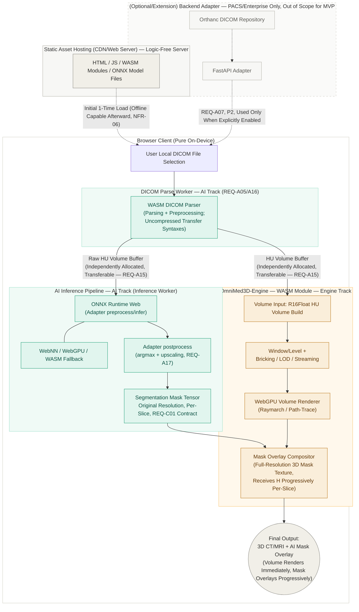

# Product Requirements Document: OmniMed3D

| Item | Details |
| --- | --- |
| Document Title | OmniMed3D PRD |
| Version | v0.9 |
| Date | 2026-07-25 |
| Last Updated | 2026-08-21 |
| Git-Tracked Since | 2026-08-16 (first committed snapshot; see `docs/prd/CHANGELOG.md`) |
| Status | Draft |
| Authors | Daewon Min (Engine), Se-hyun Park (AI) |
| Original Document | PRD_OmniMed3D_EN.md (English Original, Keep Always Synchronized) |

---

## 1. Overview

### 1.1 Product Name

OmniMed3D

### 1.2 Purpose

This document defines the product requirements for OmniMed3D. OmniMed3D is a web-based medical 3D viewer capable of immediate execution even on entry-level devices and low-spec environments. By combining WebGPU-based volume rendering with on-device AI segmentation, it aims to deliver 3D medical image analysis and AI-driven automated organ/structure segmentation where **the entire pipeline—including DICOM parsing, preprocessing, AI inference, and rendering—is completed entirely within the browser without requiring any server infrastructure.**

### 1.3 Core Value Propositions

- **High-Accessibility Analysis:** Enables 3D medical image analysis directly within a web browser without high-end workstations.
- **Pure On-Device Pipeline:** From DICOM file selection to parsing, preprocessing, AI inference, and rendering, the entire pipeline is completed inside the user's browser. Original DICOM files are never transmitted across the network in any form (no server upload exists). Users can access and use the tool immediately via a web URL without server setup or maintenance—zero installation, zero server cost, and complete on-device data privacy.
- **Offline-First:** Once initial static assets (HTML/JS/WASM/models) are loaded, the application operates independently without an active network connection. This allows usage in environments with unstable or disconnected networks, such as ambulances or mobile clinics.
- **Zero Infrastructure Cost AI:** Delivers AI-based automated organ/structure segmentation without server-side GPU infrastructure costs.
- **Cinematic Rendering Quality:** Provides cinematic-quality volumetric rendering with physically-based light scattering and denoising directly in the browser—a level of visual fidelity typically restricted to GPU workstation software.
- **Scalable Volume Handling:** Large volumes exceeding VRAM capacity (e.g., full-resolution CT/MR series) can be viewed at interactive speeds using brick-based streaming and residency management, eliminating the need to load the entire dataset into GPU memory at once.
- **Model-Agnostic Pipeline:** Fixes the mask data format consumed by the rendering module via a standardized interface (REQ-C01). This structure allows the rendering and pipeline components to be reused independently of a specific model's forward pass or post-processing implementation. Adding a new model requires writing a model-specific adapter (inference execution + post-processing) and does not imply code-free automatic substitution. Masks that cross this contract boundary are always at the same resolution as the original volume (see 5.3.1) — even when a model's input resolution is lower, that gap is absorbed inside the adapter and never exposed to the rendering side.
- **Optional Backend Adapter for Enterprise Integration:** While the primary architecture remains Pure On-Device, backends required for enterprise environments (e.g., PACS integration, high-volume batch processing) are maintained as separate, optional modules/plugins (see Sections 6.1 and 7.2). The architecture allows users to choose between standalone browser mode and backend-connected mode, with the MVP scope restricted to the former.

---

## 2. Background & Problem Statement

### 2.1 Current Status & Pain Points

| Category | Problem Statement |
| --- | --- |
| Hardware Constraints | Medical 3D image analysis is difficult without high-performance workstations. |
| Software Constraints | Lack of DICOM viewers optimized for mobile and low-spec desktop environments. |
| Technical Limitations | Existing WebGL-based web solutions suffer from performance bottlenecks, making high-quality 3D rendering challenging. |
| Accessibility Issues | Limited access to hardware or software capable of medical image analysis. |
| Data Privacy Concerns | Many existing AI-assisted diagnostic solutions transmit images to cloud or backend servers for parsing and inference, introducing risks of sensitive data leakage and high infrastructure costs. OmniMed3D eliminates this issue at the source using a Pure On-Device structure where data does not touch a server from the parsing stage onward. |
| Infrastructure Dependency | Server-based (backend container) architectures present deployment barriers in environments lacking IT infrastructure management personnel, such as public health centers or ambulances. |

### 2.2 Target Users

| User Group | Core Needs |
| --- | --- |
| Small Clinic & Health Center Clinicians | Require 3D image analysis tools without expensive workstations; must be operational without IT infrastructure setup or maintenance personnel. |
| Medical Imaging Researchers & Students | Require highly accessible viewers for research and educational purposes. |
| Telemedicine Practitioners | Require image sharing and analysis capabilities within collaborative diagnostic environments. |
| Users in Software-Restricted Environments | Require web-based tools that can be used immediately without installation permissions. |
| Emergency Medical Services & Mobile Clinics | Require fully offline viewers that function independently in unstable or disconnected network conditions. |

---

## 3. Goals & Non-Goals

### 3.1 Goals

- **G1.** Provide high-performance WebGPU-based 3D volume rendering inside web browsers.
- **G2.** Deliver automated organ and structure segmentation via on-device (WebGPU/WASM, NPU-accelerated where supported) AI inference.
- **G3.** Secure a fully client-side pipeline without server infrastructure—encompassing **DICOM parsing and preprocessing in addition to AI inference** (refer to NFR-01, NFR-05).
- **G4.** Ensure broad hardware compatibility across various device profiles, including low-spec hardware.
- **G5.** Establish an architecture capable of operating completely offline without a network connection (after initial loading of static assets).

### 3.2 Non-Goals

> The items below represent **explicit non-directions for the project** (not subject to reconsideration post-MVP). Features deferred for current phases but eligible for future review are tracked separately in Section 7.2 (Out of Scope).

- Guaranteeing clinical-grade diagnostic accuracy (this product is intended for prototype and research purposes).
- Integration with PACS systems or cloud-based DICOM repositories (consistent with the primary Pure On-Device direction; reconsidered only as an optional backend adapter task in 7.2 if required).
- Obtaining medical device regulatory certifications (e.g., FDA, CE-MDR).
- Supporting multi-channel (above RGB) rendering pipelines.

---

## 4. Success Metrics

**System & Pipeline Performance Metrics** (Primary evaluation criteria—verifying whether the on-device architecture achieves practical performance)

| Metric | Definition | Remarks |
| --- | --- | --- |
| Load Time | Time elapsed from DICOM file selection to initial rendering completion (includes in-browser WASM parsing and preprocessing time). | Initial Target (Estimated): Under 5 seconds for medium-sized volumes. Target values will be tiered by volume size and adjusted after connecting real DICOM datasets with the in-browser Parse Worker path. **Because volume rendering itself never waits for AI inference to complete (see the "Mask Delivery & Render-Decoupling Model" in 5.3.1), this metric excludes AI inference time.** |
| Rendering Frame Rate | FPS during 3D view manipulation. | Initial Target (Estimated): 30+ FPS on desktop; 15+ FPS on low-spec/throttled environments. Aims for at least 2x performance improvement over existing WebGL-based solutions in WebGPU-supported environments. |
| Device Compatibility | Proportion of normal operation across target device groups. | Includes low-spec devices. "Normal operation" adheres to specific criteria defined in Section 9. |
| AI Inference Latency | Processing time required per slice or full volume (ms). | Real-time user experience metric within browser environment (WASM/WebGPU). **Defined as the end-to-end time for a single slice, from the model forward pass through upscaling to original resolution before crossing the REQ-C01 boundary (see 5.3.1).** Initial Target (Estimated): Under 500ms per slice. (AI Track) |
| **On-Device Overhead Multiplier** | Ratio of execution time in browser (ORT Web, WASM/WebGPU respectively) compared to native ONNX Runtime (server/local) for the same quantized model. | Directly proves whether browser inference falls within a practical overhead margin. Necessary to decouple browser runtime overhead from model-level compression effects. Initial Target (Estimated): Under 3x multiplier. (AI Track) |
| **Large-Volume Parsing Memory Stability** | Occurrence of OOM or crashes when parsing representative large DICOM series (full-resolution CT/MR) on target devices. | Quantitative target to be determined (no initial estimate)—starts with verifying "zero crash execution" as browsers process large data directly without server-side safety nets. See Section 10.1 Risks. |
| User Satisfaction | Qualitative user feedback. | Not measured within this project scope (replaced by internal team review). External user testing plans are out of scope. |

> The initial targets above are **working estimates to initiate development**, not finalized benchmarks. They will be updated with empirical measurements following Phase 1 implementation.

**Model Quality Gate** (Pass criteria ensuring compression steps do not compromise pipeline quality, rather than a primary performance index)

| Metric | Definition | Remarks |
| --- | --- | --- |
| Segmentation Accuracy | Dice Coefficient, IoU | Comparison pre- and post-model compression (PTQ). Objective is not achieving peak accuracy, but ensuring no significant degradation (e.g., dropping by more than a predefined percentage point threshold) occurs post-quantization. **Evaluation is performed before upscaling (at the model's native output resolution) so that resize logic does not introduce noise into the accuracy metric.** |

Detailed metrics and target values will be redefined following the completion of initial development phases.

---

## 5. Requirements

Requirements are prioritized into **P0 (Mandatory)**, **P1 (Recommended)**, and **P2 (Optional)**. P0 defines the minimum scope required to complete the MVP, while P1 and P2 enhance robustness and scalability.

### 5.1 Rendering Track

| ID | Requirement | Priority |
| --- | --- | --- |
| REQ-R01 | WebGPU-based DICOM file loading and baseline 3D volume rendering. | P0 |
| REQ-R02 | Axial cross-sectional volume rendering. | P0 |
| REQ-R03 | Support for baseline colormaps (transfer function LUTs). | P0 |
| REQ-R04 | Resolution/quality adjustment mechanisms for performance optimization. | P0 |
| REQ-R05 | Hybrid overlay rendering of AI segmentation masks.¹ | P0 |
| REQ-R06 | Intuitive web-based user interface shell. | P0 |
| REQ-R07 | Cross-platform compatibility targeting Google Chrome.² | P0 |
| REQ-R08 | Advanced rendering modes (e.g., surface rendering). | P2 |
| REQ-R09 | Measurement tools (distance, angle, volume). | P2 |
| REQ-R10 | Collaboration tools (snapshot export, annotations). | P2 |
| REQ-R11 | Extended browser support beyond Chrome (Desktop Firefox/Safari). | P1 |

¹ **Resolution of REQ-A11 / REQ-R05 Structural Conflict:** The P0 scope for REQ-R05 is limited to compositing masks provided "as-is" by the AI pipeline—a stack of slice-by-slice 2D masks is sufficient. Because the engine's volume-texture rendering path treats mask data as a 3D texture regardless of whether it originates from slice-based 2D inference or 3D-native inference, a 2D inference pipeline yields a 3D-appearing overlay in the P0 build. Thus, REQ-R05 (P0) does not depend on the completion of REQ-A11 (P1, native full-volume 3D inference). REQ-A11 represents an accuracy and consistency enhancement layered on top of a functional P0 overlay, rather than a prerequisite for rendering. Furthermore, because the mask is always delivered at the same resolution as the original volume, progressively as each slice completes (see 5.3.1), the engine can implement the compositor on the assumption that the volume and mask textures are always aligned 1:1, with not-yet-arrived regions reading as zero-initialized background—no separate resampling logic or "partially complete volume" exception handling is required on the engine side.

² **Resolution of REQ-R07 / Section 6.3 Structural Conflict:** The P0 scope of REQ-R07 is explicitly restricted to **Google Chrome (Desktop + Mobile)** to align with technical constraints in Section 6.3. Expansion to Firefox and Desktop Safari is isolated as REQ-R11 (P1). Because the engine's WebGPU/WASM builds target Mobile Safari alongside Desktop Chrome, REQ-R11 represents an expansion of existing target platforms rather than a full re-porting effort (see Appendix A).

### 5.2 AI & Data Pipeline Track

| ID | Requirement | Priority |
| --- | --- | --- |
| REQ-A01 | Acquisition of open-source segmentation models and conversion to ONNX format. **Primary target organ finalized as lung; model finalized as lungmask (R231, Apache-2.0).** Sample training/test dataset finalized as LIDC-IDRI (see 10.2). | P0 |
| REQ-A02 | Model quantization and compression via PTQ (INT8/FP16). | P0 |
| REQ-A03 | On-device browser inference via ONNX Runtime Web (minimum functional WASM backend). | P0 |
| REQ-A04 | Preprocessing and transformation of raw DICOM data into standard tensor formats suitable for model input, without passing through backend servers. **Updated (2026-08-12, AI Track — confirmed):** split across two workers — the Parse Worker (REQ-A05) performs only model-agnostic decoding and HU conversion (RescaleSlope/Intercept), producing a raw HU tensor at original resolution; each model adapter's preprocess stage inside the Inference Worker (REQ-A03) then applies model-specific transforms (crop/resize/normalization) to that tensor. This keeps the Parse Worker stable as new model adapters are added. | P0 |
| REQ-A05 | Implementation of an in-browser DICOM parsing Web Worker (Parse Worker)—parses local files directly and transmits results (pixel array + headers) to inference and rendering workers. **Updated (2026-08-12, Engine Track; AI Track confirmed 2026-08-12):** uses the shared `dicom-parser` C++/WASM library (the same library also used by the rendering engine's native dev/test tooling; see Section 6.1/6.2), not a DCMTK/ITK port as originally described here; current parser scope covers uncompressed transfer syntaxes only (see Section 10.1) — acceptable for MVP since the LIDC-IDRI dataset (Section 10.2) is predominantly uncompressed, revisit if a compressed calibration/demo file is needed.³ | P0 |
| REQ-A06 | Integration flow delivering segmentation masks to the rendering module (verifying via integration that the REQ-C01 interface operates independently of specific model implementations). Verification includes confirming that only masks whose upscaling to original resolution has been completed by the adapter's postprocess stage enter this flow, and that slice-by-slice progressive delivery (5.3.1) functions correctly. | P0 |
| REQ-A07 | Orthanc-based DICOM storage pipeline—Not mandatory for MVP. Exists solely as an **optional backend adapter** for enterprise environments requiring PACS integration or batch processing, and must be togglable independently of the core Pure On-Device architecture. | P2 |
| REQ-A08 | Client-side de-identification capabilities—Since original DICOM files are not transmitted to servers, this is defined as an **in-browser feature selectively applied when exporting/sharing results**, rather than server middleware. | P2 |
| REQ-A09 | Decoupling AI inference execution from the main thread (UI rendering)—Isolating DICOM parsing (REQ-A05) and AI inference (REQ-A03) into separate Web Workers (Parse Worker / Inference Worker) to prevent heavy WASM parsing/decompression and inference operations from conflicting with shared dependency modules. | P1 |
| REQ-A10 | Quantitative accuracy verification based on Dice/IoU metrics and results documentation. | P1 |
| REQ-A11 | Multi-slice (full volume) inference support—Serves as an accuracy/consistency enhancement over REQ-R05 P0 overlay without blocking REQ-R05 (see Footnote ¹). | P1 |
| REQ-A12 | Docker-compose deployment packaging—Required only when deploying the optional backend adapter (REQ-A07); core product (Pure On-Device web app) must deploy via static file hosting alone. | P2 |
| REQ-A13 | Application of Quantization-Aware Training (QAT). | P2 |
| REQ-A14 | Multi-class (organ/structure-specific) segmentation. | P2 |
| REQ-A15 | Zero-Copy inter-worker data transfer via `Transferable Objects`. **Design constraint (2026-08-06):** because `Transferable Objects` are ownership transfers (not clonable to multiple recipients), the Parse Worker produces two independently-allocated buffers—the HU volume buffer for the Render Engine and a second raw HU-volume buffer for the Inference Worker (model-specific preprocessing now happens inside the Inference Worker's own adapter, per the REQ-A04 update)—and transfers each exactly once to its single consumer. Neither buffer is fanned out to a second recipient via `Structured Clone` (memory copying). In architectures handling large pixel arrays directly on the client, avoiding memory duplication directly prevents OOM and frame drops on low-spec hardware. Priority upgraded to P1. | P1 |
| REQ-A16 | Explicit separation of DICOM Parse Worker and AI Inference Worker—Isolating parsing/decompression (C++/Rust WASM) and AI inference (WebGPU/ONNX Runtime) dependency modules into separate workers to reduce browser initial memory footprint and enable parallel execution (combined with REQ-A09). | P1 |
| **REQ-A17** | **Mask upscaling—in the model adapter's postprocess stage, the local mask produced at model inference resolution is restored to the original DICOM slice resolution. Only Nearest-Neighbor interpolation is used; only slices for which this conversion is complete cross the REQ-C01 contract boundary into the progressive delivery flow of 5.3.1.** | P0 |

³ In-browser DICOM parsing must not freeze the UI (see REQ-A09/A16). The Parse Worker should be designed to consume input directly from the rendering engine's local file selection / URL fetch paths (see Appendix A) rather than building a redundant parallel file ingestion pipeline.

### 5.3 Cross-Cutting Requirements

Requirements spanning both Rendering and AI/Data Pipeline tracks that require mutual agreement and joint engineering efforts.

| ID | Requirement | Priority | Remarks |
| --- | --- | --- | --- |
| REQ-C01 | Mask Data Contract Definition (Agreement on format, coordinate systems, resolution, and data types of segmentation outputs). | P0 | **Core design principle of the project (model-agnostic / pluggable interface).** Ensures architecture independence from specific models or organ types beyond mere integration synchronization. Mandatory prerequisite for REQ-A06, REQ-R05, and REQ-A17; must be finalized early. |
| REQ-C02 | Automated Hardware Fallback Hierarchy (WebNN → WebGPU → WASM). | P1 | Both AI inference and volumetric rendering share common underlying hardware availability dependencies. |
| REQ-C03 | CI/CD Automated Testing (Cross-checking AI inference and rendering outputs using synthetic volume datasets). | P1 | Joint implementation between rendering and AI tracks. |
| REQ-C04 | Inter-Worker Data Flow Contract across the 3-Worker Pipeline (Parse → Inference / Render)—defining ownership, transfer mechanisms, and exact timing of Transferable transfers. | P1 | Alignment requirement ensuring worker isolation structures (REQ-A05/A09/A15/A16) do not conflict with the rendering engine's ingestion paths. Joint effort between Engine and AI tracks. Buffer separation (REQ-A15) and engine-parser-disabled-in-browser-path (§6.2) decided 2026-08-06. **Ownership clarified 2026-08-12:** the Inference Worker → Engine handoff specifically is owned by the Web Application Shell, not either worker directly — see §5.3.2. |

#### 5.3.1 REQ-C01 Mask Data Contract — Initial Draft Specification

> The specification below represents a starting baseline for development and will be revised during implementation if necessary (revisions will record version and rationale within this document).

| Parameter | Draft Value |
| --- | --- |
| Data Type | `uint8` single-channel (class indices); maintained as `uint8` while extending class counts for multi-class support. |
| Coordinate System & Axis Ordering | Identical axis ordering and voxel spacing to the input volume (raw HU tensor, per the REQ-A04 update). No independent resampling. |
| **Resolution *(Finalized)*** | **Always delivered at the same resolution as the original DICOM volume (the input handed off by the Parse Worker). If the model's input resolution is lower (e.g., inference after downsampling), the mask must be upscaled to the original resolution before crossing this contract boundary.** |
| **Upscaling Method *(New)*** | **Only Nearest-Neighbor interpolation is used. Value-interpolating methods such as Bilinear/Trilinear are prohibited, since they would produce values that don't exist between `uint8` class indices (e.g., 0.3, 1.7).** |
| **Upscaling Responsibility *(New)*** | **Owned by each model adapter's `postprocess` stage (REQ-A17), not the rendering engine. By the time the REQ-C01 boundary is crossed, the mask must already be aligned to the same resolution as the original volume; the rendering engine implements its compositor on the assumption that the volume and mask textures are always aligned 1:1.** |
| Background / Foreground Encoding | `0` = Background, `1..N` = Class indices. |
| Transfer Protocol | The rendering module consumes this tensor solely as overlay input and retains zero dependency on model-specific post-processing logic. |
| Verification Criteria (P0) | Integration of a 2.5D lung model via adapter (inference + post-processing, including upscaling) verifying correct operational flow against this contract. |
| Verification Criteria (Stretch / Time Permitting) | Integration of a second model architecture (e.g., 3D network) via separate adapter, demonstrating rendering/pipeline reusability without code modifications to core interfaces. Minimal post-processing (e.g., argmax + upscaling) is sufficient; clinical-grade post-processing polish is not required. Documented as an "Architectural Comparison Appendix" rather than a core feature. |
| **Engine Integration Point** | Engine consumes this contract by extending its volume-texture sampling path with a mask channel, avoiding redundant JS-side compositing layers. **MVP scope (revised 2026-08-12):** rather than the brick-atlas/page-table indirection originally described here, the engine allocates an R8Uint full-resolution 3D mask texture (as of 2026-08-18, allocated alongside the volume texture when it loads, not lazily on the first mask slice — see below) and writes each incoming slice directly into its Z-slice region, rejecting any slice whose `volumeId` or dimensions don't match the currently loaded volume — the brick-atlas/LOD system is deferred post-MVP (engine roadmap reprioritized WASM-first; bricking is a later milestone), and this row should be revised back to the brick-based description once that lands. **Updated 2026-08-18 (issue #29):** the render pass that samples these textures now exists — a front-to-back raymarch (REQ-R02) with clinical window/level via a transfer-function LUT (REQ-R03, baseline presets sourced from Mini-Engine-reference) and mask-overlay compositing in the same pass. The mask texture is now allocated eagerly in `loadVolume()` rather than lazily on the first `applyMaskSlice()` call specifically so the raymarch pass always has a valid (zero-initialized, i.e. all-background) mask texture to bind even before any segmentation slice has arrived — preserving the "volume renders immediately, mask overlay fills in progressively" decoupling model this contract already commits to. Verified visually against real DICOM data end-to-end (`viewer/tests/e2e/shell-mask-integration.spec.ts`'s second test) — real anatomical content renders, not just a flat clear color. |
| **Input Source** | The "input volume" (raw HU tensor, original resolution) consumed by this contract is generated directly by the **in-browser Parse Worker (REQ-A05)**; model-specific preprocessing (REQ-A04) happens downstream inside the Inference Worker and does not affect this contract. |

This spec is included not as "fixed truth" but to flag it as a **preliminary decision that must be finalized early in development**. During implementation, this table should either be followed as-is, or — if a better alternative emerges — revised, with the rationale recorded here.

**Mask Delivery & Render-Decoupling Model (Decided 2026-08-06; MVP transport revised 2026-08-12):** Mask data arrives incrementally at the cadence of the 2.5D inference pipeline (one slice at a time). **MVP scope:** the engine writes each incoming slice directly into the relevant Z-slice region of a full-resolution 3D mask texture (zero-initialized on allocation) rather than waiting for a complete volume mask — the brick-atlas ingestion path originally envisioned here is deferred post-MVP; this paragraph should be revised to the brick-based description once bricking lands (see Appendix A REQ-R05). A partially-filled mask texture still renders correctly either way—unfilled voxels read as background/no-overlay rather than stale or undefined data. Consequently, baseline volume rendering (and the Load Time metric, §4) never blocks on AI inference completion: the CT/MR volume renders immediately, and the mask overlay progressively fills in as slices arrive. Each slice enters this progressive delivery path only after the adapter's postprocess stage (REQ-A17) has finished upscaling it to original resolution—in other words, "a slice has arrived" always means "a slice aligned to original resolution has arrived," and the engine never needs to handle a low-resolution slice being updated again later.

#### 5.3.2 Mask Transport Contract (Message-Level) — Decided 2026-08-12 (AI Track confirmed 2026-08-12)

> **Status: Decided — AI Track confirmed 2026-08-12.** REQ-C01 defines the
> mask tensor's *format*; REQ-C04 flags that the inter-worker *transport*
> needs joint agreement but doesn't specify it. The engine track proposed
> the contract below as its working design, and the AI track has confirmed
> it against the Inference Worker implementation — this is what both
> tracks build against.

**Ownership boundary:** the AI track's responsibility ends at producing a
REQ-C01-compliant mask tensor and posting it out of the Inference Worker.
Receiving that message and calling into the rendering engine is owned by
the Web Application Shell (§6.1, REQ-R06) — not inside the Inference
Worker itself, and not inside the engine's own code. This keeps the
AI↔Engine interface to the REQ-C01 tensor format alone, without also
requiring the two tracks to co-design a Worker messaging protocol.

**Session / volume identity:** neither REQ-C01 nor REQ-A15 currently
defines how a mask consumer distinguishes slices belonging to different
volume loads. Without this, a stale slice from a previous file's
in-flight inference could apply to whatever volume happens to be loaded
when it finally arrives. A `volumeId`, minted by the Web Application Shell
each time a new file is loaded and threaded through Parse Worker →
Inference Worker → back to the Shell, lets the receiving layer discard any
mask message whose `volumeId` doesn't match the currently loaded volume.

**Message shapes:**

| Message | Fields | Notes |
| --- | --- | --- |
| `mask-slice` | `volumeId`, `sliceIndex`, `width`, `height`, `data` (Transferable `ArrayBuffer`, `uint8`, row-major, length = `width*height`) | One per completed slice. |
| `mask-complete` *(optional, P1)* | `volumeId`, `totalSlices` | UI progress only — no engine logic depends on it. Not implemented in the MVP build. |
| `mask-slice-error` *(optional, P1)* | `volumeId`, `sliceIndex`, `message` | MVP can omit — a missing slice already reads as background (zero-initialized mask texture). Not implemented in the MVP build. |

The `mask-slice` row is not illustrative — it is the field-for-field shape of the implemented `MaskSliceMessage`: the Inference Worker's own canonical definition (`viewer/src/workers/inference-worker/src/pipeline.ts`), mirrored on the receiving side by the Web Application Shell's own `MaskSliceMessage` declaration (`viewer/src/shell/main.ts`), which is what actually receives it and calls into the engine per the ownership boundary above. The one difference between the two sides — `data` typed as `Uint8Array` in `pipeline.ts` versus `ArrayBuffer` in `main.ts` — is not a discrepancy; both describe the same underlying Transferable buffer, just as each side's own code naturally references it.

**Ordering:** slices may arrive in any order — each slice update is
independent (writes one Z-region of the mask texture), so the Inference
Worker does not need to guarantee, and the Shell/Engine do not need to
buffer against, in-order delivery.

### 5.4 Non-Functional Requirements (NFR)

| ID | Requirement |
| --- | --- |
| NFR-01 | On-device execution (parsing, preprocessing, AI inference) must consume zero server computational resources (including remote GPUs). |
| NFR-02 | In the MVP phase, original DICOM files are not transmitted outside the browser (REQ-A05 Pure On-Device parsing), eliminating server-side de-identification gate requirements. Client-side de-identification (REQ-A08, P2) is provided as an optional feature when users export or share output assets. When activated, compliance requires stripping primary identifying tags (e.g., Patient Name, Birth Date, Institution Name) per DICOM PS3.15 Basic Confidentiality Profile; full profile compliance is out of scope (see Section 10.2). |
| NFR-03 | Systems must remain functional in environments lacking NPU hardware acceleration, experiencing performance degradation rather than catastrophic failure. |
| NFR-04 | Core processing pipelines must be verifiable through automated testing frameworks. |
| NFR-05 | Original DICOM datasets must not leave the user's local browser environment (and local file system). Complete client-side completion of parsing, preprocessing, and inference guarantees zero network transmission of original DICOM data. Server infrastructure (including private network servers) is completely unnecessary unless explicitly connecting through REQ-A07 optional backend adapters. |
| NFR-06 | Following the initial download of static assets (HTML/JS/WASM/models), all core DICOM parsing, AI inference, and rendering capabilities must operate fully in offline environments without network connectivity. |

---

## 6. Technical Architecture

### 6.1 Technology Stack

#### Rendering Track

| Category | Technology | Decision Rationale / Remarks |
| --- | --- | --- |
| Rendering & Volume Engine (Core) | **OmniMed3D-Engine** (C++20, Custom RHI Abstraction, ground-up reimplementation) — Vulkan (Native) + WebGPU/WASM (Emscripten) | **Correction (2026-08-07, Engine Track): Requirements in 5.1 are met by a C++20 engine (OmniMed3D-Engine) designed and implemented from scratch, not by adopting the existing Mini-Engine project as an implementation foundation — this supersedes the 2026-07-31 "adopt Mini-Engine" decision.** `Mini-Engine-reference/` is a read-only reference only — not a git submodule, not a build dependency, and its code is never reused as-is. DICOM/NIfTI parsing, HU-precision (R16Float) volume storage, clinical windowing, empty-space skipping, bricking/multi-resolution LOD/streaming/disk paging, low-spec/mobile tiering policies, and cinematic path-traced rendering are all newly implemented, informed by this reference's proven designs and algorithms — see Appendix A for the requirement-by-requirement reference mapping. |
| Web Application Shell (UI Layer Only) | Lightweight web shell wrapping the WASM canvas, built with Vite. The Shell, Parse Worker, and Inference Worker are npm workspace members under a single `viewer/package.json` root rather than three independently-installed packages. UI framework unconfirmed—assigned developer will select React or Vanilla JS and record rationale in ADR. | DICOM parsing and 3D rendering are responsibilities of the Engine (WASM module), not the web shell. Root build config (bundler, workspace layout) is a joint decision between Engine and AI tracks, per `docs/adr/0003-inference-worker-in-viewer.md`'s consequences — `inference-worker/`'s CODEOWNERS override still applies regardless of workspace membership. |
| AI Inference Integration Interface | Delivers mask tensors from ONNX Runtime Web (AI Track) to Engine via REQ-C01 contract. | Engine acts purely as a rendering consumer of mask data without dependency on specific model implementations (preserving core value proposition 1.3). Because the mask always arrives resolution-aligned to the original volume, slice by slice (REQ-A17), no resampling logic is needed on the engine side. The physical handoff (Inference Worker → Engine) is orchestrated by the Web Application Shell row above, not the Inference Worker itself — see §5.3.2. |

Composing the rendering stack purely out of JS/WebGL libraries (e.g., Three.js/Babylon.js + dicom.js) would make it difficult to implement the low-level control REQ-R01–R05 demand — HU-precision volume textures, brick-based large-volume streaming, clinical windowing, cinematic path-traced rendering, and low-spec device tiering spanning both Vulkan and WebGPU. Therefore, the rendering technology stack is a proprietary C++20 native/WASM engine (OmniMed3D-Engine), with JS/web layers restricted to a UI shell wrapping that WASM module. This engine is written from scratch, informed by Mini-Engine-reference's designs and algorithms rather than reusing its code.

> **Note:** The rendering engine (OmniMed3D-Engine) is designed natively as a client-side WASM module, aligning with the AI track's Pure On-Device pipeline from the start. DICOM parsing itself is not duplicated between the two tracks: a single shared `dicom-parser` C++ library (compiled to both a native target for the engine's dev/test tooling and a WASM target for the Parse Worker) is the one parser both sides use — see Section 6.2 for why this is one library rather than two independent implementations, and REQ-C04 for the cross-track data-flow agreement built on top of it.

#### AI & Client Pipeline Track

| Category | Technology | Remarks |
| --- | --- | --- |
| DICOM Parsing (Client) | The shared `dicom-parser` C++ library (compiled to WASM), executing in a dedicated **Parse Worker**. A from-scratch parser rather than an existing toolkit port (DCMTK/GDCM/ITK) — see Section 6.2. **Updated 2026-08-12, Engine Track; AI Track confirmed 2026-08-12.** | Current scope: uncompressed transfer syntaxes only (Explicit/Implicit VR Little Endian). Compressed pixel data (JPEG 2000/JPEG-LS/RLE) is a known limitation, not yet implemented — see Section 10.1. |
| Model Optimization (MLOps Offline Phase) | Python, ONNX Runtime (PTQ quantization, Dice/IoU validation). | Training and conversion occur offline on developer/CI environments. Distribution artifacts consist solely of static model files (`.onnx`). No runtime server exists. |
| Client Inference | TypeScript, ONNX Runtime Web, executing in a dedicated **Inference Worker**. | Decoupled into a worker separate from Parse Worker (REQ-A09/A16). The adapter's postprocess step (argmax + upscaling, REQ-A17) also runs inside this worker. |
| Hardware Acceleration | WebNN, WebGPU, WASM (Priority-based automatic fallback). | |
| Inter-Worker Data Transfer | Zero-Copy ArrayBuffer ownership transfer via `Transferable Objects`. | Used when passing pixel data between Parse Worker → Inference Worker / Render Engine (REQ-A15). |
| Static Asset Hosting | CDN or basic web server for serving static assets (HTML/JS/WASM/models). | Serves purely as static file storage without application backend logic. |
| **(Optional/Extension) Backend Adapter** | Python (FastAPI), Orthanc, Docker/Docker-compose, Nginx. | Dedicated to enterprise PACS environments. See REQ-A07/A12. Non-essential for MVP. |
| CI/CD | GitHub Actions | |

> The AI track's technology stack is designed around the premise that everything from parsing to inference is fully on-device. Model lightweighting (PTQ) and ONNX Runtime Web inference complete entirely in the browser, and no server is involved from the moment a DICOM file is opened.

### 6.2 System Architecture

> Original DICOM files enter the browser via local file selection. Parsing, preprocessing, inference, and rendering complete entirely within the client. The backend functions solely as static file hosting; optional backend adapters (dashed lines) exist only for external PACS integrations.

**Buffer Separation (REQ-A15):** The Parse Worker never transfers the same ArrayBuffer to both the Inference Worker and the Render Engine. It allocates and produces the HU volume buffer for the Render Engine and a second, independently-allocated raw HU volume buffer for the Inference Worker as two separate buffers from the outset, so each `Transferable` handoff has exactly one recipient. Model-specific preprocessing (crop/resize/normalization) is applied downstream, inside each model adapter's preprocess stage within the Inference Worker (REQ-A04, updated 2026-08-12) — the Parse Worker itself stays model-agnostic.

**Parser Redundancy Reconciliation (Decided 2026-08-06; unified into one shared library 2026-08-11):** DICOM parsing is implemented once, as a shared `dicom-parser` C++ library, compiled to three targets: (1) native, for the engine's dev/test tooling and offline test fixtures (`tests/parity/`, REQ-C03); (2) WASM, for the Parse Worker; (3) explicitly **never** linked into the engine's own browser *rendering* WASM build (the module that actually draws the volume) — that exclusion is enforced at build time (a CMake switch that omits the parser's translation units from that specific target entirely), not a runtime flag, so no parser code ends up inside the rendering WASM binary. The browser rendering path exclusively consumes the Parse Worker's HU volume buffer output, produced by build target (2) above.

**Note on mask resolution & delivery:** In the diagram above, only slices for which `F2` (adapter postprocess) has finished upscaling flow out as `H` (the REQ-C01 tensor), and `M` (the mask compositor) receives them progressively (MVP: per full-resolution mask texture Z-slice region; brick-based delivery is a post-MVP extension — see §5.3.2). This means the engine-side `M` never needs to account for either "the mask and volume resolutions might differ" or "how to display a slice that hasn't arrived yet" (the zero-initialized mask texture handles the latter naturally), which narrows the scope of new engine-side work as summarized in the REQ-R05 footnote.

**Note on transport ownership:** The `H → M` edge in the diagram is a data-flow abstraction, not a direct code call — physically, `H` is posted out of the Inference Worker and received by the Web Application Shell, which validates it (session/volume identity, §5.3.2) and calls into the Engine WASM module. Neither `F`/`F2` (AI track) nor `M` (Engine) owns that handoff directly; see §5.3.2 for the full contract.

Note that Mini-Engine-reference (a separate prior project) had explicitly excluded clinical workflow tooling (MPR 3-pane slice views, measurement rulers/angles/ROIs, DICOM worklists, annotations, crosshair sync) from its own engine project scope. This aligns with OmniMed3D-Engine's decision to keep the same scope boundary (measurement tools REQ-R09/R10, P2 non-goals/deferred scope), so there is no scope conflict to resolve separately.

### 6.3 Technical Constraints & Assumptions

| Category | Details |
| --- | --- |
| Supported Browsers | Primary focus on Google Chrome (resolving REQ-R07). Expansion to Firefox and Safari is tracked under REQ-R11 (P1). The engine's WebGPU/WASM builds target Desktop Chrome as well as Mobile Safari (see Appendix A). |
| WebNN Support Constraints | WebNN remains an experimental browser API with low overall browser/OS adoption. Validation relies primarily on WebGPU and WASM (Web Worker) backends; WebNN is treated as an opportunistic acceleration path. |
| GPU Requirements | Requires a WebGPU-compliant graphics processing unit (supported across modern GPU architectures). |
| Memory Requirements | Sufficient client system RAM is required for processing high-resolution DICOM volumes and 3D mask arrays (precise minimum thresholds to be quantified). |
| **Large-Volume Browser Parsing Memory Limits** | Processing multi-gigabyte full-resolution CT/MR series directly in-browser without server preprocessing creates OOM risks. MVP targets small-to-medium volumes, deferring chunked streaming parsing or REQ-A07 backend adapters to future phases (Section 10.1). |
| **Mask Upscaling Computational Cost** | The lower the model's inference resolution (e.g., 192×192), the larger the upscaling workload to restore it to the original slice resolution (e.g., 512×512). Even with Nearest-Neighbor, this can become a non-negligible cost across many slices; whether it runs on a WebGPU compute shader or in a WASM loop will be decided during REQ-A03/A17 implementation, and must fit within the AI inference latency target in Section 4 (500ms per slice). |
| Low-Spec Device Validation Scope | Physical test hardware is restricted to flagship mobile devices (recent iPhone/Galaxy models). Low-spec validation relies on Chrome DevTools CPU throttling (4x–6x). Physical validation on legacy entry-level hardware is deferred to future work. |
| Network | Parsing, preprocessing, inference, and rendering occur locally; core execution requires zero network bandwidth post-initial load (NFR-01/05/06, Goal G5). |
| Model Accuracy Trade-Offs | Quantization (INT8/FP16) carries risks of Dice/IoU degradation. Results and limits will be explicitly documented. |
| Performance Goals | Quantitative targets defined in Section 4. Fallback environments (WASM) prioritize functional correctness over strict frame-rate targets. |

---

## 7. Scope

### 7.1 In Scope (MVP)

- WebGPU-based DICOM viewer with fundamental 3D volume rendering capabilities.
- On-device AI segmentation pipeline (lightweight model baseline; includes upscaling to original resolution and slice-by-slice progressive delivery).
- Integration between AI mask outputs and rendering engine (hybrid overlay).
- In-browser WASM DICOM parsing and preprocessing pipeline (Parse Worker)—direct local file processing without server uploads.

### 7.2 Out of Scope (Current Phase)

> Items below are deferred features eligible for future evaluation, distinct from Section 3.2 non-goals. Permanent non-goals (PACS integration, FDA approval, multi-channel rendering, diagnostic guarantees) are omitted here.

- Display monitor calibration and strict DICOM color presentation pipeline compliance.
- Advanced pathology quantification tooling.
- Multi-class organ/structure segmentation (Phase 1 restricted to single-class segmentation).
- QAT-based advanced quantization (Phase 1 restricted to PTQ; QAT reviewed if degradation exceeds thresholds).
- Specific lesion detection (e.g., tumors with ill-defined boundaries; requires distinct datasets and task formulations).
- Backend (Orthanc/PACS) batch processing pipeline—MVP is restricted to single local series selection; REQ-A07 optional adapter managed as future work.
- Chunked streaming parsing for multi-gigabyte datasets—deferred to post-MVP evaluation.
- GPU-accelerated optimization of the upscaling operation itself—the MVP only needs to satisfy correctness (preserving class indices via Nearest-Neighbor); performance optimization of where the computation runs (WASM vs. WebGPU) is a follow-up task.

---

## 8. Milestones

| Stage | Content |
| --- | --- |
| Technical Validation | WebGPU performance benchmarking, in-browser DICOM parsing (WASM Parse Worker) implementation, ONNX model quantization, and in-browser inference verification. |
| MVP Development | Core rendering engine integration, on-device AI segmentation pipeline implementation (including parsing, upscaling, and progressive delivery). |
| Refinement | Automated hardware fallbacks, quantitative evaluation, (optional) backend adapter prototyping. |
| Testing & Optimization | Multi-environment performance profiling, large-volume parsing memory stability verification. |
| Release | MVP deployment. |
| **First Submission Deadline** | **2026-08-27** — Final report, demonstration video, and source code submission. |

Detailed sprint schedules will be established following development kickoff.

> This PRD defines "what to build." Granular PR-level tasks, dependencies, and individual acceptance criteria are managed in a separate Roadmap/Task document derived from Section 5 (Requirements) and Section 9 (Success Criteria).

---

## 9. Success Criteria

- [ ] Successful loading and 3D rendering of sample DICOM datasets (minimum 3 open dataset cases) via local file selection in Google Chrome without runtime errors.
- [ ] Execution on 4x CPU-throttled environments and flagship mobile hardware (iPhone/Galaxy) without application crashes or rendering failures (frame rate performance documented per Section 4 metrics).
- [ ] Achieving defined load time and frame rate target benchmarks against at least one WebGL-based open-source viewer (e.g., Cornerstone3D) under identical volume and hardware test conditions.
- [ ] Successful initial interaction (rotation, zoom, slice panning) by non-developer internal testers within 3 unassisted attempts.
- [ ] In-browser parsing completion across sample DICOM files originating from at least 3 distinct vendor scanners/institutions without file loading errors.
- [ ] Successful visual overlay of on-device AI segmentation results — upscaled to original resolution — on 3D volumetric renders complying with REQ-C01 contract specifications.
- [ ] Complete documentation of pre- and post-quantization Dice/IoU metrics demonstrating satisfaction of quality gate standards.
- [ ] **Empirical measurement and documentation of browser runtime overhead multipliers against native execution (Target: < 3x multiplier; see Section 4).**
- [ ] Execution of full DICOM parsing, AI inference, and 3D rendering in an offline environment with network connections severed (given pre-loaded static assets).
- [ ] The upscaled mask overlays the original volume texture with no visible misalignment (1:1 alignment).
- [ ] **The CT/MR volume renders immediately even before AI inference completes, and the mask overlay progressively fills in as slices arrive (verifying the 5.3.1 decoupling model).**

---

## 10. Risks & Open Questions

### 10.1 Risks

| Risk | Impact | Mitigation Strategy |
| --- | --- | --- |
| Low WebNN browser adoption | Failure to achieve target NPU acceleration rates | Prioritize WebGPU/WASM validation paths; treat WebNN as an opportunistic option. |
| Quantization accuracy loss | Reduced segmentation reliability | Perform quantitative Dice/IoU validation; evaluate QAT if degradation exceeds limits. |
| Inter-module data format mismatch | Integration delays and compromise of model-agnostic pluggable design | Enforce strict compliance with REQ-C01 Mask Data Contract (Section 5.3.1). |
| Memory exhaustion (OOM) on low-spec hardware during simultaneous rendering and AI execution | Application crash on target hardware | Profile minimum hardware baselines; implement adaptive resolution scaling and volume downsampling mitigations. |
| In-browser OOM when parsing large (GB-scale) DICOM series | Inability to handle full-resolution CT/MR series without server preprocessing | Restrict MVP scope to small-to-medium datasets; plan post-MVP chunked streaming parsing (Section 7.2) or REQ-A07 optional backend adapter. Minimize memory footprint via Zero-Copy transfers (REQ-A15). |
| Redundant parsing between AI Parse Worker and Rendering Engine | Duplicated parsing overhead increasing load times and RAM usage | Establish REQ-C04 contract for cross-track alignment. Permit redundancy in MVP; plan single-parser unification in post-MVP phases (Section 6.2). |
| MVP DICOM parser (`dicom-parser/`, shared library) supports only uncompressed transfer syntaxes | Real-world DICOM files using JPEG 2000 / JPEG-LS / RLE compressed pixel data will fail to decode, narrowing which files can be demoed | Explicit MVP scope decision (2026-08-12): the from-scratch shared parser targets Explicit/Implicit VR Little Endian (uncompressed) only. Section 6.1's tech-stack description anticipated decompression via an existing WASM-buildable library (DCMTK/GDCM/ITK) rather than a hand-written codec, but this project instead chose a lightweight from-scratch parser, and writing JPEG 2000/RLE codecs from scratch isn't feasible before the 2026-08-27 deadline. The designated LIDC-IDRI test dataset (Section 10.2) is predominantly distributed uncompressed, so demo/submission risk is expected to be low; revisit if a compressed-format need surfaces. |
| Upscaling computation could become a bottleneck on low-spec devices | The larger the gap between model resolution and original volume resolution, the more the postprocess stage's latency grows, potentially threatening the AI inference latency target in Section 4 (500ms per slice). | Prioritize evaluating a WebGPU compute shader as noted in 6.3; if the target isn't met, mitigate via WASM loop optimization or a downsampled display-only volume (view-only, unrelated to mask accuracy). |

### 10.2 Open Questions

| Item | Details | Decision Owner |
| --- | --- | --- |
| **Primary Target Organ / Structure** *(Finalized — Resolved)* | **Finalized as lung. Model adopted as lungmask (R231, Apache-2.0 license).** The "2.5D lung model" referenced in REQ-A01 and the 5.3.1 verification criteria (P0) refers to this exact model. The 5.3.1 stretch goal (second model) is under consideration as MONAI's `spleen_ct_segmentation` (spleen), time permitting. | **Resolved** — AI Track decision complete. |
| **Training & Evaluation Datasets** *(Resolved 2026-08-09)* | Finalized as **LIDC-IDRI** (via TCIA), license **CC BY 3.0**. Distributed as native DICOM from 7 academic institutions and 8 imaging equipment vendors, spanning 4 scanner manufacturers / 17 CT models — satisfies the Section 9 completion criteria's 3+ distinct vendor/institution requirement directly (unlike derived subsets such as LUNA16, distributed as `.mhd/.raw` rather than native DICOM, or Medical Segmentation Decathlon Task06_Lung, distributed as NIfTI with narrower vendor diversity). Unblocks REQ-A01/A02, the completion criteria's "sample DICOM" item, and the Section 8 demo video. | **Resolved** — AI Track decision complete. |
| Regulatory Compliance | Future evaluation of DICOM presentation state compliance and medical device certification requirements. | Long-term consideration; unneeded for current phase. |
| Internationalization & Multi-modal Support | Multi-language UI and support for additional imaging modalities (ultrasound, PET). | Long-term consideration; unneeded for current phase. |
| **Acceptable Accuracy Degradation Threshold** *(Proposed 2026-08-21, team-confirmed 2026-08-21)* | **Confirmed: a mean Dice degradation of no more than 1.0 percentage point vs. the FP32 reference, and no individual evaluated slice below 0.98 Dice for either class** (backed by measured data, `docs/verification/inference-worker.md` §4). Measured worst case today: INT8 right-lung Dice mean 0.9985 (0.15pp degradation), single-slice minimum 0.9931 (0.69pp) — clears both parts of the threshold with margin; FP16 is effectively at parity (mean 1.0000, minimum 0.9998-0.9999). The two-part form (mean + per-slice floor) is intentional: a mean-only gate could hide one badly-degraded outlier slice averaged out by many near-perfect ones. | **Resolved** — team-wide decision (Engine track confirmed the AI track's proposal). |
| Minimum Hardware Specifications | Defining explicit RAM/GPU baselines for low-spec support through empirical profiling. | Open for empirical testing. |
| **Parser Unification Strategy** *(Resolved 2026-08-06; unified into one shared library 2026-08-11)* | Rather than two independent parsers, DICOM parsing is one shared `dicom-parser` C++ library compiled to three targets — native (engine dev/test, `tests/parity`/REQ-C03), WASM (Parse Worker), and explicitly never linked into the engine's own browser rendering WASM build (see §6.2). Pixel-data decoding scope is currently uncompressed transfer syntaxes only (see §10.1). | **Joint (AI + Engine)** — Decided; re-open only if native/test-fixture parsing needs change. |
| **Optional Backend Adapter Priority** | Deciding whether REQ-A07/A12 remains P2 or shifts higher based on enterprise use case requirements. | On hold for review post-August 27 submission deadline. |
| **Upscaling Computation Location** *(Resolved 2026-08-21)* | **Decided: a WASM loop, not a WebGPU compute shader.** Measured directly (`docs/verification/inference-worker.md` §3): postprocess (argmax + Nearest-Neighbor upscale) takes 1-4ms per slice across all three model variants — negligible next to the >200ms this stage's own inference time, and nowhere near threatening the 500ms/slice target (§4) that motivated this open question in the first place. Building a WebGPU compute shader for a cost this small isn't justified; revisit only if a future higher-resolution model or larger upscale ratio makes this stage non-negligible. | **Resolved** — AI Track decision complete (empirical measurement, per this row's original Decision Owner). |

---

## Appendix A: Engine Requirements ↔ Mini-Engine-Reference Design Reference Mapping

Requirements in 5.1, NFR-03, NFR-05, and Goal G4 are defined independently of specific implementations. Section 6.1 records the decision to fulfill these requirements with a C++20 engine (OmniMed3D-Engine) designed and implemented from scratch. The matrix below maps each requirement to which existing design or algorithm in `Mini-Engine-reference/` informs its (new) implementation — this is not code reuse; it means a previously-validated design serves as reference material for a fresh implementation.

| Requirement | Design/Implementation Referenced from Mini-Engine-Reference (all newly implemented, not reused code) |
| --- | --- |
| REQ-R01 (DICOM Load + Baseline 3D Rendering) | A newly-built, shared DICOM parser (Explicit/Implicit VR Little Endian, uncompressed only for now — see §10.1) serving both native/test builds and the Parse Worker's WASM build, excluded at build time specifically from the engine's own browser rendering WASM build (see §6.2 Parser Redundancy Reconciliation); an NIfTI loader, HU-precision (16-bit float) volume textures, and front-to-back raymarching across Vulkan and WebGPU are likewise newly implemented — all informed by Mini-Engine-reference's parsing and rendering designs. |
| REQ-R02 (Axial Slice Rendering) | Volume rendering is newly designed around texture sampling rather than fixed clipping geometry, so axial and arbitrary oblique planes are handled via the camera/sampling pipeline — an approach validated in Mini-Engine-reference. |
| REQ-R03 (Colormaps) | Clinical window/level presets (bone, lung, soft tissue, brain) are newly wired into the shading pipeline as transfer-function LUTs, referencing Mini-Engine-reference's preset values. |
| REQ-R04 (Resolution & Performance Optimization) | Compute-based empty-space skipping, brick-based multi-resolution streaming, disk paging for volumes exceeding VRAM, and adaptive per-device-tier quality policies are all newly implemented, informed by algorithms validated in Mini-Engine-reference. |
| REQ-R05 (AI Mask Hybrid Overlay) | Adopts the same pattern as Mini-Engine-reference: extending the newly-built bricking indirection layer (page table → texture atlas) to a mask/label channel. Because the mask always arrives resolution-aligned to the original volume, progressively per slice (REQ-A17, 5.3.1), bricks can simply be filled in from their zero-initialized state without separate resampling or "partially complete" exception handling. Mask compositor implementation itself is entirely new work with no Mini-Engine-reference counterpart, built directly against the REQ-C01 contract (§5.3.1/§5.3.2). |
| REQ-R06 (Web UI Shell) | A browser control panel wrapping the WASM module (density, color, presets, windowing) is newly built, referencing Mini-Engine-reference's UI patterns; the production-grade UI is entirely new work. |
| REQ-R07 (Chrome Cross-Platform) | The WebGPU backend and WASM build are newly built targeting Chrome and Mobile Safari, referencing the build configuration Mini-Engine-reference validated for the same platforms. |
| NFR-03 (Graceful Hardware Degradation) | Device tier detection and adaptive quality policy patterns are newly implemented at the engine level, referencing Mini-Engine-reference's validated design. |
| NFR-05 (Local DICOM Privacy) | The engine's ingestion flow is newly designed so volumetric datasets are processed entirely client-side with no code path communicating with third-party cloud endpoints. Because this matches the AI track's Pure On-Device direction, the rendering engine is designed to satisfy this requirement from the outset. |
| Goal G4 (Broad Hardware Compatibility) | Adaptive sample counts and denoising policies reacting to camera motion and device tier, plus brick-based memory scaling, are newly implemented, referencing policies validated in Mini-Engine-reference. |

REQ-R01–R04 and REQ-R07 are all newly implemented, but because they reference designs and algorithms already validated once in Mini-Engine-reference (DICOM/NIfTI parsing strategy, HU-precision volume textures, bricking/streaming, cinematic path-tracing, Chrome + Mobile Safari targeting), architectural risk is substantially reduced — though the code itself is a reimplementation, not a port. On top of this full reimplementation, OmniMed3D-specific new work is added:

1. Mask overlay compositor (REQ-R05 / REQ-C01).
2. Interfacing local file loading paths with the AI Parse Worker output (`Transferable ArrayBuffer`, REQ-A05/A15/REQ-C04).
3. Developing a product-grade web UI shell wrapping the WASM module (REQ-R06).
